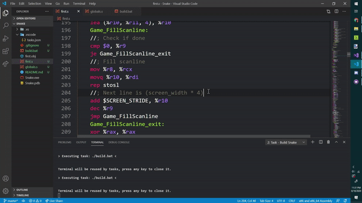

# Asm Snake

This is a challenge I put for myself. The rules are simple:
- Remake the classic game "Snake"
- It must be made in Assembly (the Assembler is your choice)
- The only external libraries allowed are OS APIs (Win32 in this case).

This project took about two days totalling around 700 lines of code and the process makes you realize how many helpful abstractions we take for granted, I emplore anyone to try this.

# Controls
WASD or Arrow Keys - Moves the snake around
Enter - Restarts the game once you've game overed.

# Resources
[Releases](https://github.com/RealNeGate/AsmSnake/releases)

[Snake Icon](https://creazilla.com/nodes/45196-snake-emoji-clipart)

[Snake Icon License (CC v4.0)](https://creativecommons.org/licenses/by/4.0/)
